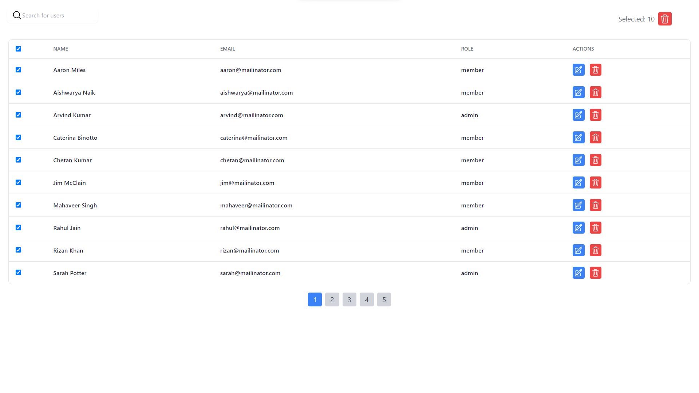
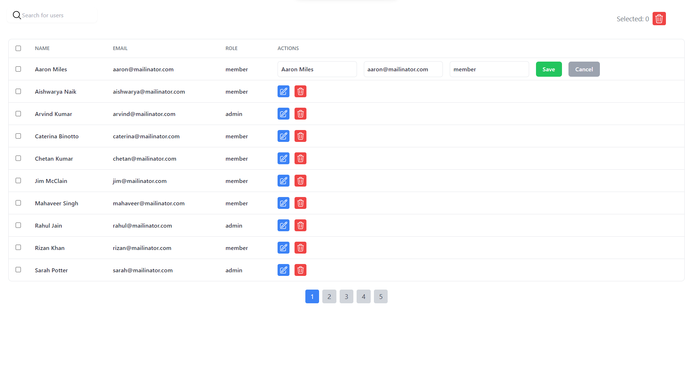
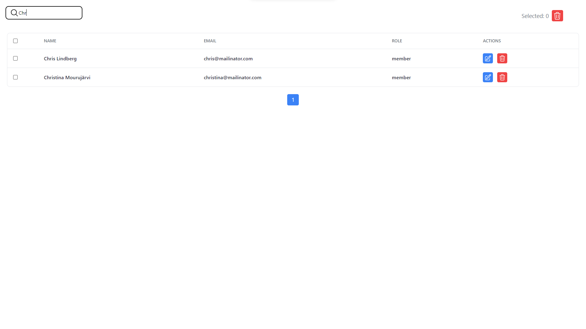

# Admin Dashboard

Welcome to the Admin Dashboard project! This project provides an interface for admins to view and manage users through a user-friendly dashboard. Users are fetched via an API, and you can perform various actions like searching, editing, and deleting.

## Demo

## Features

1. **Column Titles that Stand Out:** Clearly distinguishable from user entries for enhanced readability.
2. **Dynamic Search Bar:** Filter users based on any property, providing a seamless search experience.
3. **In-Place Editing and Deletion:** Easily edit or delete user records directly within the dashboard (no persistence).
4. **Pagination for Efficient Navigation:** Navigate through pages with options for first, previous, next, and last pages. Pagination dynamically adjusts based on search results.
5. **Effortless Row Selection:** Select one or more rows with a grayish background for easy identification. Perform batch deletion using the 'Delete Selected' button.
6. **Select/Deselect All Shortcut:** Convenient checkbox on the top left to select or deselect all displayed rows on the current page.
7. **Search Box Placeholder:** Starts with "Search" for clear user guidance.
8. **Search Trigger Options:** Initiate search either by pressing ENTER or clicking the search icon/button.
9. **Action Elements with Consistent Class Names:** Clearly defined buttons with specific class names like edit, delete, save.
10. **Navigation Elements with Intuitive Class Names:** Divs/Buttons named for easy identification - first-page, previous-page, next-page, last-page.
